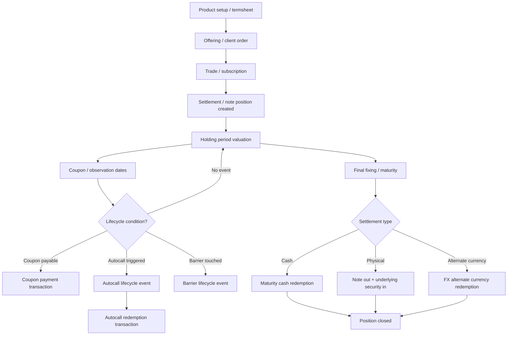

# 02 — Note Lifecycle, Transactions, and Position Modelling

## 1. Key Modelling Principle

A note should be modelled as one client security position, supported by contract terms and lifecycle events.

Do not create separate client positions for embedded options, CDS-like exposure, barriers, autocall features, or FX conversion rights. Those are terms of the note contract.

Create a new client position only when something is actually delivered to the client, such as shares delivered after physical settlement.

---

## 2. Separate Four Concepts

A clean wealth-platform model separates these concepts:

| Concept | Purpose | Example |
|---|---|---|
| Instrument / Note Contract | Defines the security and payoff terms | Issuer, maturity, coupon, barrier, underlyings |
| Lifecycle Event | Records something observed or triggered | Barrier touched, coupon condition passed, autocall triggered |
| Transaction | Records an actual economic posting | Buy, coupon payment, redemption, physical delivery |
| Position | Current client holding after transactions | Nominal amount, units, cost, market value, status |

Rule:

```text
Lifecycle events explain what happened under the termsheet.
Transactions explain what was actually posted to the portfolio.
Positions are derived from settled transactions and valuation.
```

---

## 3. Generic Note Lifecycle



---

## 4. Core Transaction Model

Transaction design should be accounting-grade and reusable across note types.

| Field | Meaning |
|---|---|
| transaction_id | Unique transaction ID |
| transaction_group_id | Groups multi-leg events such as physical settlement |
| account_id | Client account or portfolio |
| instrument_id | Note or delivered security |
| transaction_type | Economic transaction classification |
| trade_date | Execution date |
| value_date | Settlement date |
| booking_date | Accounting/system booking date |
| quantity_delta | Change in units, if applicable |
| nominal_delta | Change in face amount |
| price_pct | Price as percentage of par, if applicable |
| gross_amount | Amount before fees/tax |
| fees | Commission, platform fee, custody charge |
| tax | Withholding tax, stamp duty, transaction tax |
| net_amount | Actual cash movement |
| cash_currency | Currency of cash movement |
| settlement_currency | Currency settled |
| accrued_interest_amount | Clean/dirty pricing and accrual handling |
| realized_pnl | Realized gain/loss on disposal/redemption |
| income_amount | Coupon or income amount |
| lifecycle_event_id | Link to observation, autocall, maturity, credit event, etc. |
| reversal_of_transaction_id | Link to original transaction for correction/reversal |
| source_system | Custodian, issuer, product engine, corporate-action feed, manual ops |
| performance_classification | Income, internal trade, external cashflow, fee, tax, loss, conversion |

---

## 5. Recommended Transaction Types

| Transaction Type | Use |
|---|---|
| NOTE_SUBSCRIPTION | Primary market purchase of note |
| NOTE_SECONDARY_BUY | Secondary market purchase |
| NOTE_SECONDARY_SELL | Secondary market sale before maturity |
| NOTE_TRANSFER_IN | Transfer from another account/custodian |
| NOTE_TRANSFER_OUT | Transfer out |
| NOTE_COUPON_PAYMENT | Actual coupon paid |
| NOTE_COUPON_ACCRUAL | Optional accounting accrual, usually for unconditional coupon |
| NOTE_AUTOCALL_REDEMPTION | Early redemption triggered by autocall |
| NOTE_MATURITY_CASH_REDEMPTION | Cash redemption at maturity |
| NOTE_PHYSICAL_REDEMPTION_OUT | Note closed due to physical settlement |
| NOTE_PHYSICAL_DELIVERY_IN | Delivered shares/bonds/securities received |
| NOTE_CASH_IN_LIEU | Fractional or residual cash adjustment |
| NOTE_FX_ALTERNATE_CCY_REDEMPTION | Dual currency note redeemed in alternate currency |
| NOTE_PARTIAL_REDEMPTION | Partial paydown or partial redemption |
| NOTE_ISSUER_CALL_REDEMPTION | Issuer calls note under call feature |
| NOTE_INVESTOR_PUT_REDEMPTION | Investor exercises put feature |
| NOTE_CREDIT_EVENT_WRITEDOWN | CLN loss after reference credit event |
| NOTE_RECOVERY_PAYMENT | Recovery after credit event |
| NOTE_DEFAULT_WRITEOFF | Issuer default or full write-off |
| NOTE_FEE | Product, custody, platform, or transaction fee |
| NOTE_TAX_WITHHOLDING | Tax withheld from coupon/redemption |
| NOTE_CORRECTION_REVERSAL | Operational reversal or correction |

Do not create transaction types for every lifecycle observation.

| Event | Transaction? | Reason |
|---|---|---|
| Observation date check | No | No economic posting yet |
| Barrier touched | Usually no | Changes lifecycle status only |
| Knock-in activated | Usually no | Economic impact occurs at settlement/maturity |
| Coupon condition satisfied | No | Transaction occurs when coupon is paid |
| Autocall condition satisfied | No initially | Transaction occurs on redemption payment date |
| Final fixing | No initially | Transaction occurs when redemption/conversion settles |

---

## 6. Lifecycle Event Model

A lifecycle event table is required for notes because many events affect status and payoff without immediately changing position or cash.

| Field | Example |
|---|---|
| lifecycle_event_id | EVT123 |
| instrument_id | NOTE123 |
| event_type | OBSERVATION, COUPON_DETERMINATION, BARRIER_BREACH, AUTOCALL_TRIGGER, FINAL_FIXING |
| event_date | 2026-04-10 |
| effective_date | 2026-04-10 |
| payment_date | 2026-04-17 |
| underlying_id | AAPL_US |
| observed_value | 210.00 |
| condition_value | 200.00 |
| result | PASSED, FAILED, TRIGGERED |
| status | PENDING, CONFIRMED, CANCELLED |
| generated_transaction_id | Nullable until transaction is posted |
| source | Issuer, custodian, product engine, corporate-action feed |

This allows the system to answer:

- What was observed?
- Which condition was tested?
- What was the result?
- Was the result confirmed by issuer/custodian?
- Was an economic transaction generated?

---

## 7. Position Model for Notes

A note position should be held using both unit and nominal fields.

| Field | Meaning |
|---|---|
| account_id | Client portfolio/account |
| instrument_id | Note instrument |
| quantity_units | Number of units/lots |
| nominal_amount | Quantity × denomination |
| original_nominal_amount | Original face amount bought |
| current_nominal_amount | Current face amount after partial redemption/paydown |
| cost_amount | Cost basis including/excluding fees based on policy |
| average_cost_pct | Average cost as % of par |
| accrued_income | Accrued coupon/interest where applicable |
| market_price_pct | Current price as % of par |
| market_value | Current nominal × price % + accrued income if dirty valuation |
| valuation_currency | Usually note currency |
| settlement_currency | Currency of settlement/redemption |
| unrealized_pnl | Market value less cost basis |
| realized_pnl | Realized gain/loss on sale/redemption/conversion |
| lifecycle_status | ACTIVE, KNOCKED_IN, AUTOCALLED, MATURED, DEFAULTED |
| next_observation_date | Next scheduled observation |
| next_coupon_date | Next expected coupon date |
| barrier_status | Not touched, touched, active, breached |
| physical_delivery_pending | Yes/no |
| issuer_risk_id | Issuer exposure |
| lookthrough_exposure_status | Available/unavailable/stale |

Accounting position vs analytical exposure:

| Concept | Example |
|---|---|
| Accounting position | Client owns Apple-linked note NOTE123 |
| Analytical look-through exposure | Client has economic exposure to Apple |
| Actual Apple position | Created only if note physically settles into Apple shares |

---

## 8. Lifecycle by Note Type

### 8.1 Plain Vanilla Note / Medium-Term Note

| Lifecycle Event | Transaction Type | Position Impact | Cash Impact |
|---|---|---|---|
| Subscription/buy | NOTE_SUBSCRIPTION or NOTE_SECONDARY_BUY | Increase note nominal | Cash out |
| Coupon payment | NOTE_COUPON_PAYMENT | No nominal change | Cash in |
| Secondary sale | NOTE_SECONDARY_SELL | Reduce note nominal | Cash in, net fees/tax |
| Maturity | NOTE_MATURITY_CASH_REDEMPTION | Reduce note nominal to zero | Principal cash in |
| Issuer default | NOTE_DEFAULT_WRITEOFF | Reduce/write down position | Loss booked |

Lifecycle is similar to a bond.

---

### 8.2 Principal-Protected Note

| Lifecycle Event | Transaction Type | Position Impact | Cash Impact |
|---|---|---|---|
| Subscription | NOTE_SUBSCRIPTION | Increase note nominal | Cash out |
| Periodic coupon | Usually none, unless terms specify | Usually no change | Depends on terms |
| Secondary sale | NOTE_SECONDARY_SELL | Reduce note nominal | Cash at market/issuer bid |
| Maturity with upside | NOTE_MATURITY_CASH_REDEMPTION | Close note | Principal + upside cash |
| Maturity no upside | NOTE_MATURITY_CASH_REDEMPTION | Close note | Principal only |
| Issuer default | NOTE_DEFAULT_WRITEOFF | Write down | Loss |

Principal protection is usually contractual at maturity and subject to issuer credit.

---

### 8.3 Equity-Linked Note / Reverse Convertible / Fixed Coupon Note

| Lifecycle Event | Transaction Type | Position Impact | Cash Impact |
|---|---|---|---|
| Buy note | NOTE_SUBSCRIPTION | Increase note nominal | Cash out |
| Coupon paid | NOTE_COUPON_PAYMENT | No note change | Cash in |
| Barrier observed/touched | Lifecycle event only | Status may become KNOCKED_IN | No cash |
| Final safe outcome | NOTE_MATURITY_CASH_REDEMPTION | Close note | Principal cash in |
| Final downside cash settlement | NOTE_MATURITY_CASH_REDEMPTION | Close note | Cash less loss |
| Final physical settlement | NOTE_PHYSICAL_REDEMPTION_OUT + NOTE_PHYSICAL_DELIVERY_IN | Note closes, shares created | Shares received, cash-in-lieu if any |
| Secondary sale | NOTE_SECONDARY_SELL | Reduce note | Cash at bid/market price |

Important: barrier status is lifecycle information. It usually does not create a transaction by itself.

---

### 8.4 Worst-Of Note

Worst-of notes follow FCN/reverse-convertible mechanics but evaluate multiple underlyings.

| Lifecycle Event | Transaction Type | Position Impact |
|---|---|---|
| Coupon payment | NOTE_COUPON_PAYMENT | No note quantity change |
| Barrier breach by any underlying | Lifecycle event | Update breached/worst underlying status |
| Maturity cash redemption | NOTE_MATURITY_CASH_REDEMPTION | Close note |
| Maturity physical settlement | NOTE_PHYSICAL_REDEMPTION_OUT + NOTE_PHYSICAL_DELIVERY_IN | Note closes, worst-performing security delivered |

The transaction model remains the same. The contract model stores multiple underlyings and worst-of logic.

---

### 8.5 Autocallable / Phoenix Note

| Lifecycle Event | Transaction Type | Position Impact | Cash Impact |
|---|---|---|---|
| Subscription | NOTE_SUBSCRIPTION | Increase note | Cash out |
| Coupon observation passed | Lifecycle event | Coupon entitlement created | No cash yet |
| Coupon paid | NOTE_COUPON_PAYMENT | No note change | Cash in |
| Coupon missed | Lifecycle event | Memory coupon balance may increase | No cash |
| Autocall condition met | Lifecycle event | Status = pending redemption | No cash yet |
| Autocall settlement | NOTE_AUTOCALL_REDEMPTION | Close note | Principal + coupon |
| No autocall | No transaction | Position remains active | No cash |
| Final safe maturity | NOTE_MATURITY_CASH_REDEMPTION | Close note | Principal + final coupon |
| Final downside maturity | NOTE_MATURITY_CASH_REDEMPTION or physical settlement | Close note | Cash loss or delivered security |

Autocall trigger date and redemption payment date may differ. Model them separately.

---

### 8.6 Dual Currency Note

| Lifecycle Event | Transaction Type | Position Impact | Cash Impact |
|---|---|---|---|
| Subscription | NOTE_SUBSCRIPTION | Increase note | Cash out in investment currency |
| Coupon payment | NOTE_COUPON_PAYMENT | No note change | Cash in original or alternate currency, depending on terms |
| Final FX fixing | Lifecycle event | Determines redemption currency | No cash yet |
| Redeemed in original currency | NOTE_MATURITY_CASH_REDEMPTION | Close note | Cash in original currency |
| Redeemed in alternate currency | NOTE_FX_ALTERNATE_CCY_REDEMPTION | Close note | Cash in alternate currency |

There is no separate FX option position for the client. The FX option is embedded in the note terms.

---

### 8.7 Credit-Linked Note

| Lifecycle Event | Transaction Type | Position Impact | Cash Impact |
|---|---|---|---|
| Subscription | NOTE_SUBSCRIPTION | Increase note | Cash out |
| Coupon payment | NOTE_COUPON_PAYMENT | No note change | Cash in |
| No credit event by maturity | NOTE_MATURITY_CASH_REDEMPTION | Close note | Principal cash in |
| Credit event occurs | Lifecycle event | Status = CREDIT_EVENT_TRIGGERED | No cash initially |
| Loss determined | NOTE_CREDIT_EVENT_WRITEDOWN | Reduce carrying value/nominal | Loss booked |
| Recovery paid | NOTE_RECOVERY_PAYMENT | Reduce/close remaining claim | Cash/security recovery |
| Issuer default | NOTE_DEFAULT_WRITEOFF | Write down | Loss |

Issuer and reference entity must be modelled separately.

---

### 8.8 Interest-Rate-Linked Note

| Lifecycle Event | Transaction Type | Position Impact |
|---|---|---|
| Rate fixing | Lifecycle event | Coupon rate determined |
| Coupon payment | NOTE_COUPON_PAYMENT | No nominal change |
| Issuer call | NOTE_ISSUER_CALL_REDEMPTION | Close note |
| Maturity | NOTE_MATURITY_CASH_REDEMPTION | Close note |

Rate-linked notes require fixing records and forward-rate/yield-curve valuation support.

---

### 8.9 Exchange-Traded Note

| Lifecycle Event | Transaction Type | Position Impact |
|---|---|---|
| Exchange buy | NOTE_SECONDARY_BUY | Increase units/nominal |
| Exchange sell | NOTE_SECONDARY_SELL | Reduce units/nominal |
| Fee drag | Usually reflected in price/indicative value | No separate transaction unless charged separately |
| Issuer redemption/call | NOTE_ISSUER_CALL_REDEMPTION | Close note |
| Maturity | NOTE_MATURITY_CASH_REDEMPTION | Close note |

ETNs trade operationally like listed instruments, but risk classification remains note/issuer debt.

---

## 9. Physical Settlement Modelling

Physical settlement is common in equity-linked notes and reverse convertibles.

Example:

| Term | Value |
|---|---:|
| Notional | USD 100,000 |
| Strike | USD 200 |
| Final underlying price | USD 120 |
| Settlement | Physical |
| Shares delivered | 100,000 / 200 = 500 shares |

Transaction group:

| Transaction Type | Instrument | Quantity / Nominal | Cash | Accounting Effect |
|---|---|---:|---:|---|
| NOTE_PHYSICAL_REDEMPTION_OUT | Apple-linked note | -100,000 nominal | 0 | Close note |
| NOTE_PHYSICAL_DELIVERY_IN | Apple shares | +500 shares | 0 | Create equity position |
| NOTE_CASH_IN_LIEU | Cash | 0 | Small residual | Fractional adjustment |
| NOTE_TAX_WITHHOLDING | Cash | 0 | Negative cash | Tax, if applicable |

Cost basis policy must be explicit.

| Policy | Meaning |
|---|---|
| Carryover basis | Delivered shares inherit note carrying value. |
| Fair value basis | Delivered shares booked at market value and note realizes loss. |
| Tax basis | Jurisdiction-specific treatment. |

For performance, physical delivery is usually an internal security transformation if assets remain within the same portfolio.

---

## 10. Performance Treatment

| Event | Performance Classification |
|---|---|
| Subscription funded from outside portfolio | External inflow |
| Buy funded from existing portfolio cash | Internal investment transaction |
| Coupon paid into portfolio cash | Investment income |
| Fee paid from portfolio | Expense |
| Tax withheld | Tax expense / withholding |
| Sale proceeds kept in portfolio | Internal disposal |
| Redemption proceeds kept in portfolio | Internal disposal |
| Coupon withdrawn by client | Income first, then external outflow |
| Physical delivery | Internal security conversion |
| Issuer default/write-off | Investment loss |
| CLN credit event loss | Investment loss |
| DCI alternate currency redemption | Investment result plus FX exposure |

For TWR:

- External client contributions/withdrawals are external cashflows.
- Coupons, market movements, redemptions, conversions, write-downs, and security sales are investment activity inside the portfolio unless cash enters or leaves the portfolio externally.

---

## 11. Operational Edge Cases

| Edge Case | Required Handling |
|---|---|
| Trade date differs from settlement date | Position may be pending until value date; cash may be reserved. |
| Price quoted clean but valuation needs dirty value | Add accrued income separately. |
| Conditional coupon expected but not confirmed | Do not book income until entitlement confirmed. |
| Autocall triggered but payment not settled | Status = pending redemption; keep position until redemption transaction. |
| Barrier touched intraday | Depends on terms: continuous, daily close, final-only, or observation-date-only. |
| Partial sale before maturity | Reduce nominal and cost basis proportionally. |
| Partial redemption/paydown | Reduce current nominal and adjust realized P&L. |
| Multiple underlyings with different currencies | Store underlying currency and FX conversion separately. |
| Physical delivery produces fractional share | Use cash-in-lieu transaction. |
| Issuer quote unavailable | Use fallback valuation source and stale price indicators. |
| Correction or cancellation | Use reversal transactions; do not hard-delete accounting history. |
| Corporate action on underlying | Impacts observation levels, adjustment factors, strike, barrier, conversion ratio. |
| Knock-in triggered but final recovery above strike | Terms decide final redemption; do not assume loss until payoff calculation. |
| Credit event disputed or pending auction | Use lifecycle status pending until confirmed. |

---

## 12. Recommended State Machine

| Position State | Meaning |
|---|---|
| PENDING_SUBSCRIPTION | Order/trade exists but not settled. |
| ACTIVE | Note is held and live. |
| ACTIVE_WITH_BARRIER_EVENT | Barrier or knock-in event occurred but note continues. |
| COUPON_PENDING | Coupon entitlement determined but not paid. |
| AUTOCALL_PENDING | Autocall triggered; redemption not settled. |
| PHYSICAL_DELIVERY_PENDING | Settlement determined as physical; delivered security not posted yet. |
| CREDIT_EVENT_PENDING | Credit event announced but loss/recovery not finalized. |
| MATURED_PENDING_SETTLEMENT | Maturity occurred but cash/security not settled. |
| CLOSED | Position fully redeemed, sold, or converted. |
| DEFAULTED | Issuer default or write-off state. |

Position status should be derived from lifecycle events and unsettled transactions where possible.
